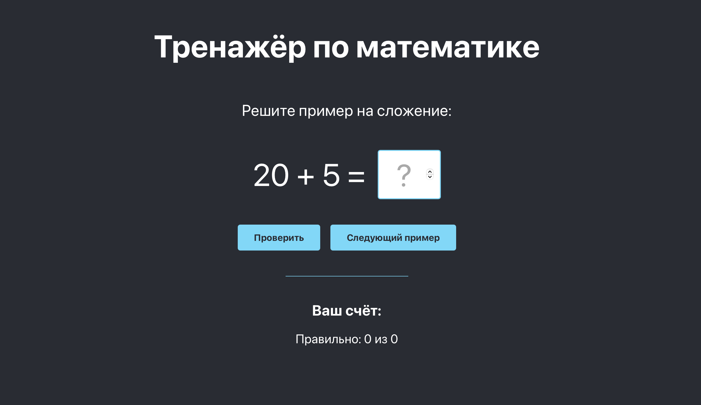
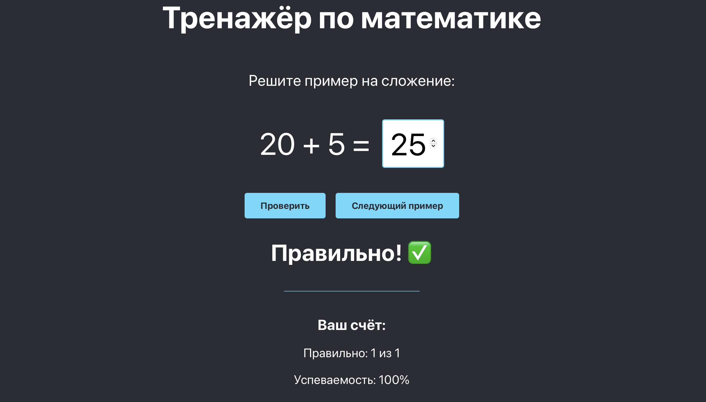
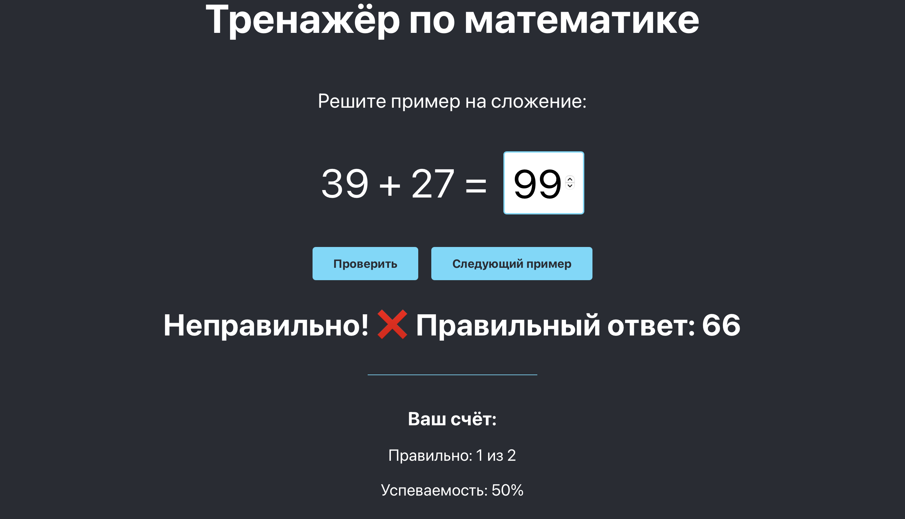

# Тренажёр по математике - сложение

## Описание:
Это простое React-приложение, которое помогает практиковать навыки сложениея. Пользователь получает случайный пример, вводит ответ и получает обрастную связь. Также есть возможность отслеживать успеваемость.

## Основной функционал: 
- Генерация случайных примеров на сложение;
- Проверка ответов;
- Подсчёт правильных и неправильных ответов.

## Скриншоты:

